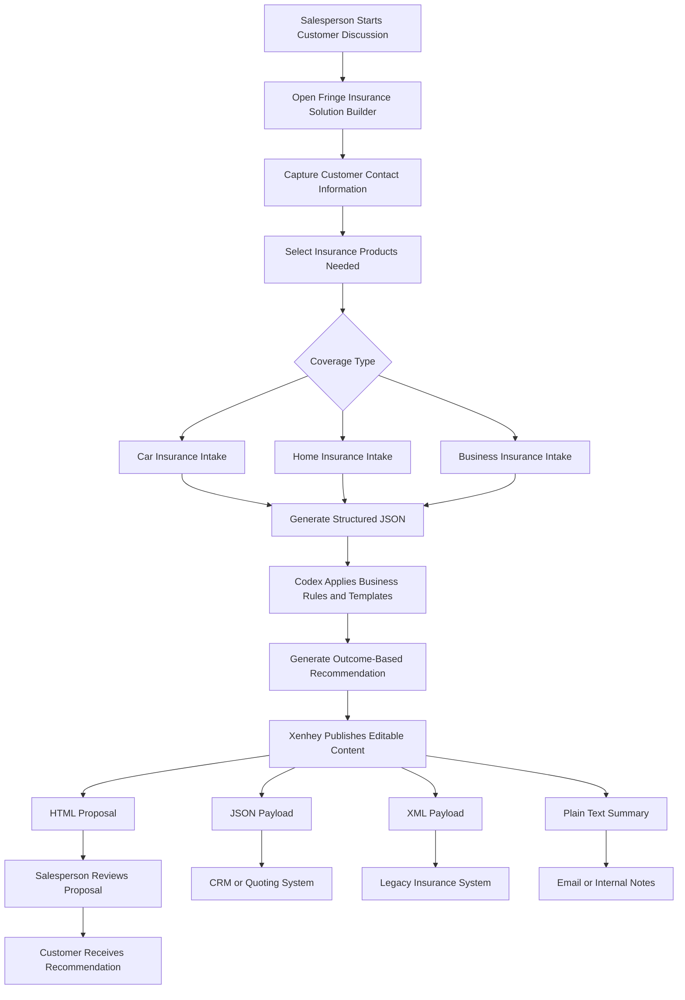

# Fringe-Insurance

## Use Case: Codex with Xenhey to Produce Outcome-Based Insurance Solutions for Fringe Insurance

### 1. Use Case Title

**Outcome-Based Insurance Solution Builder Using Codex and Xenhey**

### 2. Client

**Fringe Insurance**

Fringe is an insurance company that offers:

* Car insurance
* Home insurance
* Business insurance

Fringe wants a modern way for sales teams to discuss customer needs, quickly shape insurance solution options, generate structured intake data, and publish customer-facing or internal content without waiting on development teams for every small change.

---

## 3. Business Scenario

As a **sales person**, I want to discuss a project or insurance opportunity with a customer and capture their business needs in a structured way, so that Codex can help generate a clear outcome-based solution and Xenhey can publish the result as editable HTML, JSON, XML, or plain text.

The goal is not just to collect form data. The goal is to help the salesperson produce a complete insurance recommendation package that connects customer needs to measurable outcomes.

For example, a customer may say:

> “I need coverage for my home, two vehicles, and a small catering business.”

The salesperson should be able to enter the conversation notes into a simple intake interface. Codex can then generate a recommended insurance solution, while Xenhey publishes the final output as:

* A customer-facing HTML proposal
* A JSON payload for integration
* XML for legacy insurance systems
* Plain text for email, CRM notes, or internal review
* Editable content that sales or operations teams can update inline

---

# 4. Business Problem

Fringe Insurance currently has challenges such as:

1. Sales conversations are often captured in free-form notes.
2. Different salespeople may explain products differently.
3. Customer needs across car, home, and business insurance are not always mapped to clear outcomes.
4. Proposal content may require manual formatting.
5. Updating product language, disclaimers, or coverage descriptions often requires technical support.
6. Structured data may be needed for CRM, underwriting, quoting, or document generation.
7. Sales teams need faster ways to move from conversation to recommendation.

---

# 5. Proposed Solution

Use **Codex with Xenhey** to create an outcome-based insurance solution builder for Fringe.

Codex will help generate the application logic, intake forms, transformation rules, and output templates.

Xenhey will act as the publishing and content management layer that allows Fringe to publish and inline-edit:

* HTML insurance proposal pages
* JSON request and response payloads
* XML documents for system integration
* Plain text templates for emails, summaries, and notes

The salesperson uses the solution to capture customer needs, select insurance categories, generate recommendations, and publish an editable outcome-based proposal.

---

# 6. Primary Actor

## Salesperson

The salesperson uses the application to:

* Capture customer contact information
* Discuss the customer’s insurance needs
* Select coverage areas
* Capture risk details
* Generate a recommended solution
* Review output before sharing
* Publish or export the final content

---

# 7. Supporting Actors

## Customer

Provides information about their insurance needs, property, vehicle, business, risks, and desired outcomes.

## Sales Manager

Reviews proposal quality, sales activity, and conversion reports.

## Underwriting Team

Reviews structured risk information and determines eligibility, pricing, or additional requirements.

## Marketing Team

Updates approved content, product descriptions, campaign language, and disclaimers through Xenhey inline editing.

## IT / Integration Team

Uses JSON or XML output to connect with CRM, policy administration, quoting engines, or document generation platforms.

---

# 8. Goals and Outcomes

## Business Goals

| Goal                        | Description                                                  |
| --------------------------- | ------------------------------------------------------------ |
| Improve sales consistency   | Every salesperson follows a guided solution-building process |
| Speed up proposal creation  | Generate proposal-ready content from intake data             |
| Improve customer experience | Present clear, outcome-based recommendations                 |
| Reduce manual formatting    | Publish HTML, JSON, XML, or text from structured templates   |
| Enable business editing     | Allow non-technical users to update content inline           |
| Improve data quality        | Convert sales conversations into structured insurance data   |
| Support integrations        | Send clean JSON/XML to downstream systems                    |

---

## Desired Customer Outcomes

| Customer Need         | Outcome-Based Solution                                                                           |
| --------------------- | ------------------------------------------------------------------------------------------------ |
| Protect vehicles      | Car insurance options based on vehicle usage, drivers, mileage, and liability needs              |
| Protect home          | Home insurance options based on property type, location, value, and risk factors                 |
| Protect business      | Business insurance options based on industry, employees, revenue, assets, and liability exposure |
| Bundle coverage       | Combined recommendation across car, home, and business                                           |
| Understand gaps       | Identify missing or underinsured coverage areas                                                  |
| Receive fast proposal | Generate a professional proposal during or shortly after the sales discussion                    |

---

# 9. Scope of the Use Case

## In Scope

* Sales intake form
* Car insurance intake
* Home insurance intake
* Business insurance intake
* Outcome-based recommendation engine
* Editable proposal content using Xenhey
* HTML proposal publishing
* JSON payload generation
* XML payload generation
* Plain text summary generation
* Sales reporting tables
* Proposal status tracking
* CRM-ready output

## Out of Scope

* Binding insurance policies automatically
* Final underwriting approval
* Payment processing
* Claims processing
* Legal policy document generation unless integrated later
* Real-time pricing unless connected to a rating engine

---

# 10. High-Level Process Flow



---

# 11. Detailed User Story

## User Story

As a **salesperson at Fringe Insurance**,
I want to capture customer insurance needs for car, home, and business coverage,
so that I can generate an outcome-based insurance solution proposal using Codex and publish it through Xenhey in editable HTML, JSON, XML, or plain text formats.

---

# 12. Use Case Narrative

A salesperson meets with a potential customer who may need one or more insurance products. The salesperson opens the Fringe Insurance Solution Builder.

The system asks for basic contact information first. The salesperson then chooses the insurance categories the customer is interested in:

* Car
* Home
* Business
* Bundle package

For each selected category, the system presents a guided intake section. The salesperson enters details from the customer conversation.

After intake is complete, the system generates a structured JSON payload. Codex uses predefined business rules, templates, and prompts to produce an outcome-based recommendation.

Xenhey publishes the output in multiple formats. The salesperson can review and inline-edit the HTML proposal before sending it to the customer. The same information can also be exported as JSON for CRM, XML for legacy systems, and plain text for internal notes.

---

# 13. Functional Requirements

## 13.1 Customer Contact Intake

The system shall capture:

| Field                    | Description                                       |
| ------------------------ | ------------------------------------------------- |
| First Name               | Customer first name                               |
| Last Name                | Customer last name                                |
| Email                    | Customer email                                    |
| Phone                    | Customer phone number                             |
| Address                  | Customer address                                  |
| City                     | Customer city                                     |
| State / Province         | Customer region                                   |
| Postal Code              | Customer postal code                              |
| Preferred Contact Method | Email, phone, text                                |
| Customer Type            | Individual, family, business owner                |
| Salesperson Name         | Assigned salesperson                              |
| Lead Source              | Website, referral, call center, campaign, walk-in |

---

## 13.2 Insurance Product Selection

The system shall allow the salesperson to select one or more products:

| Product            | Description                                           |
| ------------------ | ----------------------------------------------------- |
| Car Insurance      | Personal or commercial vehicle coverage               |
| Home Insurance     | Homeowner, condo, renter, landlord coverage           |
| Business Insurance | Small business, liability, property, workers coverage |
| Bundle             | Combined recommendation across multiple products      |

---

## 13.3 Car Insurance Intake

The system shall capture:

| Field                 | Description                             |
| --------------------- | --------------------------------------- |
| Vehicle Make          | Manufacturer                            |
| Vehicle Model         | Model name                              |
| Vehicle Year          | Year of vehicle                         |
| VIN                   | Vehicle identification number           |
| Vehicle Usage         | Personal, business, delivery, rideshare |
| Annual Mileage        | Estimated yearly mileage                |
| Number of Drivers     | Drivers covered                         |
| Driver Age Range      | Age range of drivers                    |
| Driving History       | Accidents, violations, clean record     |
| Current Coverage      | Existing coverage information           |
| Desired Coverage      | Liability, collision, comprehensive     |
| Deductible Preference | Low, medium, high                       |
| Roadside Assistance   | Yes / No                                |
| Rental Coverage       | Yes / No                                |

---

## 13.4 Home Insurance Intake

The system shall capture:

| Field                   | Description                                         |
| ----------------------- | --------------------------------------------------- |
| Property Type           | Single family, condo, townhouse, rental             |
| Ownership Type          | Owner occupied, tenant occupied, rented             |
| Year Built              | Year property was built                             |
| Property Value          | Estimated value                                     |
| Replacement Cost        | Estimated replacement cost                          |
| Square Footage          | Size of property                                    |
| Roof Age                | Age of roof                                         |
| Security System         | Yes / No                                            |
| Fire Protection         | Smoke detectors, sprinklers, alarms                 |
| Flood Risk              | Low, medium, high, unknown                          |
| Prior Claims            | Prior home insurance claims                         |
| Personal Property Value | Estimated value of belongings                       |
| Additional Structures   | Garage, shed, pool, detached structure              |
| Desired Coverage        | Dwelling, personal property, liability, loss of use |

---

## 13.5 Business Insurance Intake

The system shall capture:

| Field                         | Description                                                              |
| ----------------------------- | ------------------------------------------------------------------------ |
| Business Name                 | Legal or trade name                                                      |
| Industry                      | Business industry                                                        |
| Business Type                 | LLC, corporation, sole proprietor, partnership                           |
| Years in Business             | Years operating                                                          |
| Annual Revenue                | Estimated revenue                                                        |
| Number of Employees           | Employee count                                                           |
| Business Location             | Physical, remote, hybrid                                                 |
| Property Coverage Needed      | Yes / No                                                                 |
| General Liability Needed      | Yes / No                                                                 |
| Professional Liability Needed | Yes / No                                                                 |
| Workers Compensation Needed   | Yes / No                                                                 |
| Commercial Auto Needed        | Yes / No                                                                 |
| Cyber Coverage Needed         | Yes / No                                                                 |
| Prior Claims                  | Business claim history                                                   |
| Key Risks                     | Customer-stated risk concerns                                            |
| Desired Outcome               | Compliance, asset protection, liability protection, contract requirement |

---

# 14. Outcome-Based Recommendation Logic

The system should organize recommendations around outcomes instead of only product names.

## Example Outcome Categories

| Outcome                                | Related Insurance                              |
| -------------------------------------- | ---------------------------------------------- |
| Protect my vehicle                     | Car insurance                                  |
| Protect my home and belongings         | Home insurance                                 |
| Protect my business from lawsuits      | Business general liability                     |
| Protect my employees                   | Workers compensation                           |
| Protect my income after a covered loss | Business interruption or loss of use           |
| Protect against cyber incidents        | Cyber liability                                |
| Reduce my total insurance cost         | Bundled coverage                               |
| Meet contract requirements             | Business liability or certificate of insurance |
| Improve family protection              | Home, auto, umbrella coverage                  |

---

# 15. Example Customer Scenario

## Scenario

A customer named **Jordan Smith** owns a home, drives two vehicles, and operates a small catering business from a commercial kitchen.

Jordan wants:

* Home coverage
* Auto coverage
* Business liability coverage
* Protection for business equipment
* A bundled solution if it reduces cost

## Salesperson Input

The salesperson enters Jordan’s information and selects:

* Car insurance
* Home insurance
* Business insurance
* Bundle recommendation

## Generated Outcome-Based Recommendation

| Customer Goal              | Recommended Solution                                                              |
| -------------------------- | --------------------------------------------------------------------------------- |
| Protect personal vehicles  | Auto policy with liability, collision, comprehensive, and roadside assistance     |
| Protect residence          | Home policy with dwelling, personal property, liability, and loss-of-use coverage |
| Protect catering operation | Business owner policy with general liability and business property coverage       |
| Protect business income    | Business interruption coverage                                                    |
| Reduce total premium       | Bundle home, auto, and business coverage                                          |
| Improve protection         | Consider umbrella liability coverage                                              |

---

# 16. Xenhey Content Publishing Use Case

Xenhey allows Fringe to publish the same solution in multiple formats.

## 16.1 HTML Output

Used for customer-facing proposal pages.

Example:

```html
<section class="proposal">
  <h1>Fringe Insurance Recommendation for Jordan Smith</h1>
  <p>Based on your current needs, we recommend a bundled insurance solution covering your home, vehicles, and catering business.</p>

  <h2>Recommended Outcomes</h2>
  <ul>
    <li>Protect your personal vehicles</li>
    <li>Protect your home and belongings</li>
    <li>Protect your business from liability claims</li>
    <li>Reduce total insurance cost through bundled coverage</li>
  </ul>
</section>
```

## 16.2 JSON Output

Used for CRM, quoting engines, APIs, or reporting.

```json
{
  "customer": {
    "firstName": "Jordan",
    "lastName": "Smith",
    "email": "jordan.smith@example.com",
    "phone": "555-222-1000"
  },
  "selectedProducts": [
    "Car Insurance",
    "Home Insurance",
    "Business Insurance"
  ],
  "recommendedOutcomes": [
    {
      "outcome": "Protect personal vehicles",
      "recommendation": "Auto policy with liability, collision, comprehensive, and roadside assistance"
    },
    {
      "outcome": "Protect home and belongings",
      "recommendation": "Home policy with dwelling, personal property, liability, and loss-of-use coverage"
    },
    {
      "outcome": "Protect business operations",
      "recommendation": "Business owner policy with general liability and business property coverage"
    }
  ],
  "proposalStatus": "Draft"
}
```

## 16.3 XML Output

Used for legacy insurance or document systems.

```xml
<InsuranceProposal>
  <Customer>
    <FirstName>Jordan</FirstName>
    <LastName>Smith</LastName>
    <Email>jordan.smith@example.com</Email>
    <Phone>555-222-1000</Phone>
  </Customer>
  <SelectedProducts>
    <Product>Car Insurance</Product>
    <Product>Home Insurance</Product>
    <Product>Business Insurance</Product>
  </SelectedProducts>
  <RecommendedOutcomes>
    <Outcome>
      <Name>Protect personal vehicles</Name>
      <Recommendation>Auto policy with liability, collision, comprehensive, and roadside assistance</Recommendation>
    </Outcome>
    <Outcome>
      <Name>Protect home and belongings</Name>
      <Recommendation>Home policy with dwelling, personal property, liability, and loss-of-use coverage</Recommendation>
    </Outcome>
  </RecommendedOutcomes>
</InsuranceProposal>
```

## 16.4 Plain Text Output

Used for CRM notes, email summaries, or internal review.

```text
Customer: Jordan Smith

Selected Products:
- Car Insurance
- Home Insurance
- Business Insurance

Recommended Outcomes:
1. Protect personal vehicles with auto liability, collision, comprehensive, and roadside assistance.
2. Protect home and belongings with dwelling, personal property, liability, and loss-of-use coverage.
3. Protect business operations with general liability and business property coverage.
4. Reduce total cost by bundling home, auto, and business insurance.

Proposal Status: Draft
```

---

# 17. Inline Editing Capabilities

With Xenhey, authorized business users can inline-edit published content such as:

| Editable Content     | Example                                                                    |
| -------------------- | -------------------------------------------------------------------------- |
| Product descriptions | “Business insurance protects your company from unexpected financial loss.” |
| Coverage language    | Update auto coverage descriptions                                          |
| Disclaimers          | Modify legal or compliance language                                        |
| Proposal sections    | Add new customer-facing content blocks                                     |
| Email text           | Change sales email templates                                               |
| JSON field labels    | Adjust integration mappings                                                |
| XML templates        | Modify output for legacy systems                                           |
| Plain text summaries | Update CRM note format                                                     |

This reduces dependency on developers for simple content updates.

---

# 18. Codex Development Use Case

Codex can be used to generate the solution components required by Fringe.

## Codex Responsibilities

| Area           | Codex Can Generate                    |
| -------------- | ------------------------------------- |
| Frontend       | Bootstrap 5 intake forms              |
| API payloads   | JSON request and response structures  |
| Business rules | Recommendation mapping logic          |
| Templates      | HTML, JSON, XML, plain text templates |
| Validation     | Required fields and input rules       |
| Reports        | Tables and dashboards                 |
| Integration    | REST API examples                     |
| Storage        | SQL table schemas                     |
| Documentation  | User stories and technical specs      |

---

# 19. Codex Steps to Build the Solution

## Step 1: Create the Bootstrap 5 Sales Intake Interface

Prompt for Codex:

```text
Create a professional Bootstrap 5 insurance sales intake application for Fringe Insurance.

The application should support:
- Customer contact intake
- Product selection for car, home, and business insurance
- Separate intake sections for each selected product
- Outcome-based recommendation summary
- Proposal preview section
- Mobile responsive layout
- Professional insurance company design

Use clean HTML, CSS, and JavaScript.
```

---

## Step 2: Create Customer Contact Form

Prompt for Codex:

```text
Create a customer contact form for Fringe Insurance with the following fields:

- First Name
- Last Name
- Email
- Phone
- Address
- City
- State or Province
- Postal Code
- Preferred Contact Method
- Customer Type
- Lead Source
- Assigned Salesperson

Use Bootstrap 5 cards and form controls.
Include client-side validation for required fields.
```

---

## Step 3: Create Product Selection Flow

Prompt for Codex:

```text
Create a product selection section for Fringe Insurance.

The user should be able to select one or more insurance products:
- Car Insurance
- Home Insurance
- Business Insurance
- Bundle Recommendation

When a product is selected, show the matching intake section.
When it is unselected, hide that section.
```

---

## Step 4: Create Car Insurance Intake Section

Prompt for Codex:

```text
Create a Bootstrap 5 car insurance intake section with fields for:

- Vehicle Make
- Vehicle Model
- Vehicle Year
- VIN
- Vehicle Usage
- Annual Mileage
- Number of Drivers
- Driver Age Range
- Driving History
- Current Coverage
- Desired Coverage
- Deductible Preference
- Roadside Assistance
- Rental Coverage

Return the collected data as a structured JSON object named carInsurance.
```

---

## Step 5: Create Home Insurance Intake Section

Prompt for Codex:

```text
Create a Bootstrap 5 home insurance intake section with fields for:

- Property Type
- Ownership Type
- Year Built
- Property Value
- Replacement Cost
- Square Footage
- Roof Age
- Security System
- Fire Protection
- Flood Risk
- Prior Claims
- Personal Property Value
- Additional Structures
- Desired Coverage

Return the collected data as a structured JSON object named homeInsurance.
```

---

## Step 6: Create Business Insurance Intake Section

Prompt for Codex:

```text
Create a Bootstrap 5 business insurance intake section with fields for:

- Business Name
- Industry
- Business Type
- Years in Business
- Annual Revenue
- Number of Employees
- Business Location
- Property Coverage Needed
- General Liability Needed
- Professional Liability Needed
- Workers Compensation Needed
- Commercial Auto Needed
- Cyber Coverage Needed
- Prior Claims
- Key Risks
- Desired Outcome

Return the collected data as a structured JSON object named businessInsurance.
```

---

## Step 7: Create Outcome-Based Recommendation Logic

Prompt for Codex:

```text
Create JavaScript recommendation logic for Fringe Insurance.

The logic should analyze selected products and intake answers, then generate recommendations based on customer outcomes.

Outcome categories should include:
- Protect personal vehicles
- Protect home and belongings
- Protect business from liability
- Protect employees
- Protect business property
- Protect against cyber risk
- Reduce insurance cost through bundling
- Meet contract or compliance requirements

Return an array named recommendedOutcomes with outcome, recommendation, priority, and relatedProduct.
```

---

## Step 8: Generate Xenhey Output Templates

Prompt for Codex:

```text
Create four output templates for the Fringe Insurance proposal:

1. HTML proposal template
2. JSON payload template
3. XML payload template
4. Plain text summary template

Each template should use the same customer, selected product, intake, and recommendation data.

The templates should be compatible with Xenhey publishing and inline editing.
```

---

## Step 9: Create Proposal Preview

Prompt for Codex:

```text
Create a proposal preview page for Fringe Insurance.

The preview should show:
- Customer name
- Selected insurance products
- Key risks identified
- Recommended outcomes
- Suggested next steps
- Proposal status

Include buttons for:
- Generate HTML
- Generate JSON
- Generate XML
- Generate Plain Text
- Publish to Xenhey
```

---

## Step 10: Create API Payload for Xenhey Publishing

Prompt for Codex:

```text
Create a JavaScript function that sends the generated Fringe Insurance proposal to a Xenhey publishing endpoint.

The payload should include:
- proposalId
- customer
- selectedProducts
- carInsurance
- homeInsurance
- businessInsurance
- recommendedOutcomes
- outputFormat
- contentBody
- createdBy
- createdAt
- proposalStatus

Use fetch API with POST method.
Include placeholders for API endpoint and API key.
```

---

# 20. Sample Xenhey Publishing Payload

```json
{
  "proposalId": "PROP-100245",
  "clientName": "Fringe Insurance",
  "createdBy": "Salesperson",
  "createdAt": "2026-05-29T10:30:00Z",
  "proposalStatus": "Draft",
  "customer": {
    "firstName": "Jordan",
    "lastName": "Smith",
    "email": "jordan.smith@example.com",
    "phone": "555-222-1000",
    "customerType": "Business Owner"
  },
  "selectedProducts": [
    "Car Insurance",
    "Home Insurance",
    "Business Insurance"
  ],
  "carInsurance": {
    "vehicleMake": "Toyota",
    "vehicleModel": "Highlander",
    "vehicleYear": "2023",
    "vehicleUsage": "Personal and Business",
    "annualMileage": 18000,
    "desiredCoverage": [
      "Liability",
      "Collision",
      "Comprehensive",
      "Roadside Assistance"
    ]
  },
  "homeInsurance": {
    "propertyType": "Single Family",
    "ownershipType": "Owner Occupied",
    "propertyValue": 475000,
    "securitySystem": true,
    "desiredCoverage": [
      "Dwelling",
      "Personal Property",
      "Liability",
      "Loss of Use"
    ]
  },
  "businessInsurance": {
    "businessName": "Jordan Catering Group",
    "industry": "Food Service",
    "annualRevenue": 350000,
    "numberOfEmployees": 8,
    "generalLiabilityNeeded": true,
    "propertyCoverageNeeded": true,
    "workersCompensationNeeded": true,
    "cyberCoverageNeeded": true
  },
  "recommendedOutcomes": [
    {
      "outcome": "Protect personal vehicles",
      "recommendation": "Auto insurance with liability, collision, comprehensive, and roadside assistance.",
      "priority": "High",
      "relatedProduct": "Car Insurance"
    },
    {
      "outcome": "Protect home and belongings",
      "recommendation": "Home insurance with dwelling, personal property, liability, and loss-of-use coverage.",
      "priority": "High",
      "relatedProduct": "Home Insurance"
    },
    {
      "outcome": "Protect business operations",
      "recommendation": "Business owner policy with general liability, business property, workers compensation, and cyber coverage.",
      "priority": "High",
      "relatedProduct": "Business Insurance"
    },
    {
      "outcome": "Reduce total cost",
      "recommendation": "Consider bundled home, auto, and business coverage where eligible.",
      "priority": "Medium",
      "relatedProduct": "Bundle"
    }
  ],
  "xenheyPublishing": {
    "outputFormats": [
      "html",
      "json",
      "xml",
      "plainText"
    ],
    "inlineEditingEnabled": true,
    "contentStatus": "Editable Draft"
  }
}
```

---

# 21. Reporting Requirements

## Sales Activity Report

| Column            | Description                                    |
| ----------------- | ---------------------------------------------- |
| Proposal ID       | Unique proposal reference                      |
| Customer Name     | Customer full name                             |
| Salesperson       | Assigned salesperson                           |
| Products Selected | Car, home, business, bundle                    |
| Proposal Status   | Draft, reviewed, sent, accepted, rejected      |
| Created Date      | Date proposal was created                      |
| Last Updated      | Last modified date                             |
| Estimated Premium | Estimated premium if available                 |
| Next Action       | Follow up, underwriting review, quote required |

---

## Product Interest Report

| Product            | Number of Leads | Proposal Count | Conversion Count | Conversion Rate |
| ------------------ | --------------: | -------------: | ---------------: | --------------: |
| Car Insurance      |             120 |             95 |               45 |             47% |
| Home Insurance     |             100 |             80 |               38 |             48% |
| Business Insurance |              75 |             60 |               22 |             37% |
| Bundle             |              50 |             45 |               28 |             62% |

---

## Outcome Report

| Outcome                         | Number of Customers | Common Product     | Priority |
| ------------------------------- | ------------------: | ------------------ | -------- |
| Protect vehicles                |                  95 | Car Insurance      | High     |
| Protect home and belongings     |                  80 | Home Insurance     | High     |
| Protect business from liability |                  60 | Business Insurance | High     |
| Reduce total cost               |                  45 | Bundle             | Medium   |
| Meet contract requirement       |                  25 | Business Insurance | High     |

---

## Proposal Status Report

| Status              | Description                      |
| ------------------- | -------------------------------- |
| Draft               | Created but not reviewed         |
| Sales Reviewed      | Reviewed by salesperson          |
| Manager Reviewed    | Reviewed by sales manager        |
| Sent to Customer    | Shared with customer             |
| Underwriting Review | Sent for risk review             |
| Accepted            | Customer accepted recommendation |
| Rejected            | Customer declined                |
| Closed              | Opportunity closed               |

---

# 22. Data Model

## Customer Table

| Column        | Type         | Description                        |
| ------------- | ------------ | ---------------------------------- |
| CustomerId    | varchar(50)  | Unique customer ID                 |
| FirstName     | varchar(100) | First name                         |
| LastName      | varchar(100) | Last name                          |
| Email         | varchar(150) | Email                              |
| Phone         | varchar(50)  | Phone                              |
| Address       | varchar(250) | Address                            |
| City          | varchar(100) | City                               |
| StateProvince | varchar(100) | State or province                  |
| PostalCode    | varchar(20)  | Postal code                        |
| CustomerType  | varchar(100) | Individual, family, business owner |
| LeadSource    | varchar(100) | Lead source                        |

---

## Proposal Table

| Column              | Type          | Description                     |
| ------------------- | ------------- | ------------------------------- |
| ProposalId          | varchar(50)   | Unique proposal ID              |
| CustomerId          | varchar(50)   | Related customer                |
| SalespersonName     | varchar(150)  | Assigned salesperson            |
| SelectedProducts    | nvarchar(max) | JSON array of selected products |
| RecommendedOutcomes | nvarchar(max) | JSON array of recommendations   |
| ProposalStatus      | varchar(50)   | Current proposal status         |
| CreatedAt           | datetime      | Created date                    |
| UpdatedAt           | datetime      | Last updated date               |

---

## Insurance Intake Table

| Column        | Type          | Description                    |
| ------------- | ------------- | ------------------------------ |
| IntakeId      | varchar(50)   | Unique intake ID               |
| ProposalId    | varchar(50)   | Related proposal               |
| ProductType   | varchar(50)   | Car, home, business            |
| IntakePayload | nvarchar(max) | Full JSON intake data          |
| RiskScore     | int           | Optional calculated risk score |
| CreatedAt     | datetime      | Created date                   |

---

## Xenhey Published Content Table

| Column               | Type          | Description                 |
| -------------------- | ------------- | --------------------------- |
| ContentId            | varchar(50)   | Unique content ID           |
| ProposalId           | varchar(50)   | Related proposal            |
| OutputFormat         | varchar(50)   | HTML, JSON, XML, plain text |
| ContentBody          | nvarchar(max) | Published content           |
| InlineEditingEnabled | bit           | Whether editable            |
| ContentStatus        | varchar(50)   | Draft, published, archived  |
| CreatedAt            | datetime      | Created date                |
| UpdatedAt            | datetime      | Last modified date          |

---

# 23. Acceptance Criteria

| ID     | Acceptance Criteria                                                       |
| ------ | ------------------------------------------------------------------------- |
| AC-001 | Salesperson can create a new customer insurance discussion                |
| AC-002 | Salesperson can select car, home, business, or bundle options             |
| AC-003 | System displays only the intake forms relevant to selected products       |
| AC-004 | System generates structured JSON from all intake sections                 |
| AC-005 | System generates outcome-based recommendations                            |
| AC-006 | System creates HTML proposal content                                      |
| AC-007 | System creates JSON output for integration                                |
| AC-008 | System creates XML output for legacy systems                              |
| AC-009 | System creates plain text summary                                         |
| AC-010 | Xenhey allows inline editing of published content                         |
| AC-011 | Salesperson can preview the proposal before sending                       |
| AC-012 | Proposal status can be tracked                                            |
| AC-013 | Reports can show product interest, proposal status, and customer outcomes |

---

# 24. Example Final Sales Proposal Output

## Fringe Insurance Recommendation

**Customer:** Jordan Smith
**Customer Type:** Business Owner
**Selected Coverage Areas:** Car, Home, Business

### Recommended Insurance Outcomes

| Outcome                     | Recommendation                                                                                         | Priority |
| --------------------------- | ------------------------------------------------------------------------------------------------------ | -------- |
| Protect personal vehicles   | Auto insurance with liability, collision, comprehensive, and roadside assistance                       | High     |
| Protect home and belongings | Home insurance with dwelling, personal property, liability, and loss-of-use coverage                   | High     |
| Protect business operations | Business insurance with general liability, property coverage, workers compensation, and cyber coverage | High     |
| Reduce total insurance cost | Bundle eligible policies where possible                                                                | Medium   |

### Suggested Next Steps

1. Review coverage needs with customer.
2. Confirm property and vehicle details.
3. Send structured intake data to quoting system.
4. Route business coverage to underwriting if needed.
5. Publish final proposal through Xenhey.
6. Send customer-facing proposal link or email summary.

---

# 25. Business Value

| Value Area                     | Benefit                                                          |
| ------------------------------ | ---------------------------------------------------------------- |
| Sales Enablement               | Helps salespeople lead consistent insurance conversations        |
| Faster Proposal Creation       | Converts intake data into proposal content quickly               |
| Better Customer Experience     | Customers receive clear outcome-based recommendations            |
| Improved Data Quality          | Structured forms reduce incomplete or inconsistent data          |
| Business Agility               | Xenhey inline editing allows quick content updates               |
| System Integration             | JSON and XML outputs support CRM, quoting, and legacy systems    |
| Reduced Development Dependency | Business users can update published content without code changes |
| Better Reporting               | Leadership can track demand by product and outcome               |

---

# 26. Summary

The **Codex with Xenhey Outcome-Based Insurance Solution Builder** gives Fringe Insurance a flexible platform for turning sales conversations into structured, editable, and publishable insurance recommendations.

Codex helps generate the intake experience, recommendation logic, payload structures, and templates. Xenhey enables Fringe to publish and inline-edit HTML, JSON, XML, and plain text outputs.

Together, they help Fringe create a faster, more consistent, and more business-friendly process for selling car, home, and business insurance.
